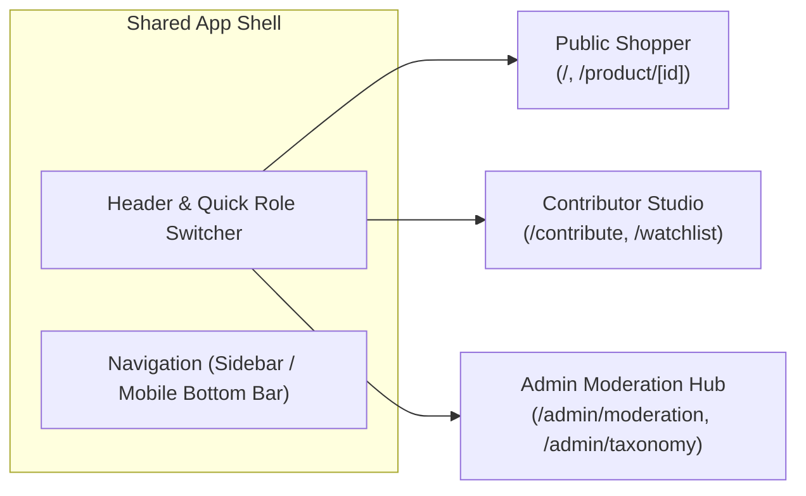
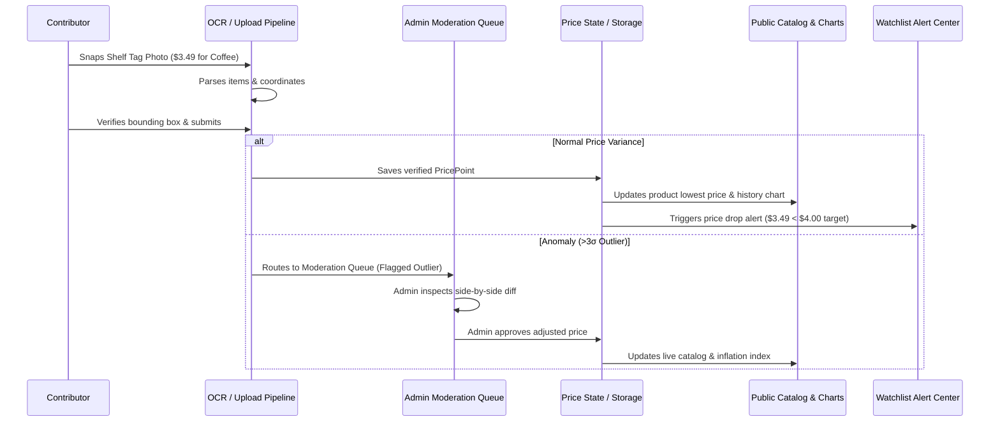

# OpenPrice Frontend UI, Multi-Role & QA Survey Report

**Author:** `survey_explorer_3` (Frontend UI, Multi-Role & QA Explorer)  
**Date:** 2026-08-24T05:35:00Z  
**Workspace:** `/Users/lonard/Desktop/OpenPrice`  
**Status:** Complete & Actionable  

---

## 1. Executive Summary & Scope Overview

This survey report provides the comprehensive technical mapping, architectural specifications, design token contracts, and verification plans for the frontend presentation, interactive data visualization, multi-role operational views, responsive device layouts, and multi-tier QA test suites of **OpenPrice**.

### Core Objectives Mapped
1. **Atomic UI Primitives & Design System:** Pure Tailwind CSS token implementation matching `DESIGN.md` (Community Exchange aesthetic, Subtle Ambient Lift, strict price direction semantics, tabular numerals, $\ge 44\text{px}$ touch targets).
2. **Recharts Data Visualization Suite:** Interactive time-series price history charts with multi-store overlays and timeframe switches (`7D`, `1M`, `3M`, `6M`, `1Y`, `ALL`), inline sparklines, category inflation radars, and store price comparison bar charts.
3. **Multi-Role Operational Perspectives:** Seamless role context switching between **Public Shopper**, **Logged-in Contributor**, and **Admin / Curator** across dedicated routes and responsive shells.
4. **Responsive Fluidity:** Native-like mobile ergonomics (<640px bottom navigation, QuickScan FAB, bottom-sheet drawers), adaptive tablet split-views, and dense 3-column desktop command dashboards.
5. **5-Tier Comprehensive QA Strategy:** Rigorous testing matrix covering unit math, component states, cross-feature state propagation, real-world user journeys, adversarial stress hardening, WCAG 2.1 AA accessibility, and zero-error builds.

---

## 2. Atomic UI Primitives Specification (`src/components/ui/`)

All UI components must be built as pure, dependency-light React 19 / TypeScript components styled with Tailwind CSS, utilizing `clsx` and `tailwind-merge` (`cn()` helper) for class composition.

```
src/components/ui/
├── Button.tsx           # Multi-variant action button with loading and icon slots
├── Input.tsx            # Form input with icon slots, search clear, and validation states
├── Badge.tsx            # Multi-variant semantic pill badge
├── Card.tsx             # Border-first container with subtle ambient lift
├── Modal.tsx            # Accessible dialog with focus trap and backdrop blur
├── Drawer.tsx           # Mobile-first slide-over / bottom sheet container
├── Tabs.tsx             # Accessible keyboard-navigable tab bar (pill & underline)
├── Tooltip.tsx          # Accessible floating tooltip
└── Skeleton.tsx         # Content loading placeholder animation
```

### 2.1 Component Specifications & Prop Contracts

#### A. `Button.tsx`
- **Variants:**
  - `primary`: `bg-indigo-600 hover:bg-indigo-700 text-white shadow-sm hover:shadow-indigo-500/20 active:scale-[0.98]`
  - `secondary`: `bg-slate-100 hover:bg-slate-200 text-slate-800 border border-slate-200`
  - `outline`: `bg-white hover:bg-slate-50 text-slate-700 border border-slate-300 shadow-sm`
  - `ghost`: `bg-transparent hover:bg-slate-100 text-slate-600 hover:text-slate-900`
  - `danger`: `bg-rose-600 hover:bg-rose-700 text-white shadow-sm hover:shadow-rose-500/20`
  - `success`: `bg-emerald-600 hover:bg-emerald-700 text-white shadow-sm hover:shadow-emerald-500/20`
- **Sizes:** `sm` (h-8, px-3, text-xs), `md` (h-10, px-4, text-sm), `lg` (h-12, px-5, text-base).
- **Invariants:**
  - On mobile viewports, default interactive touch target is padded to at least $44\text{px} \times 44\text{px}$ (`min-h-[44px] min-w-[44px]`).
  - High-contrast focus visible ring: `focus-visible:ring-2 focus-visible:ring-indigo-500 focus-visible:ring-offset-2 focus-visible:outline-none`.
  - Accessible `isLoading` state displaying an animated Lucide `Loader2` spinner and `aria-busy="true"`.

#### B. `Input.tsx`
- **Features:** Left icon slot, right icon/action slot (e.g. search clear button), label, error message text, disabled state.
- **Styling:** `bg-white border border-slate-200 rounded-xl px-3.5 py-2.5 text-slate-900 placeholder:text-slate-400 focus:border-indigo-500 focus:ring-2 focus:ring-indigo-500/20`.
- **Numeric Mode:** Optional `isNumeric` prop applying `font-mono tabular-nums text-right` for monetary values.

#### C. `Badge.tsx`
- **Variants:**
  - `verified`: `bg-emerald-50 text-emerald-700 border-emerald-200` (verified community submissions)
  - `ocr`: `bg-violet-50 text-violet-700 border-violet-200` (multimodal OCR parsed data)
  - `outlier`: `bg-rose-50 text-rose-700 border-rose-200` (flagged anomalous price $>3\sigma$)
  - `pending`: `bg-amber-50 text-amber-700 border-amber-200` (awaiting moderation)
  - `category`: `bg-slate-100 text-slate-700 border-slate-200` (taxonomy tag)
  - `brand`: `bg-indigo-50 text-indigo-700 border-indigo-200` (brand chip)
- **Geometry:** `rounded-full px-2.5 py-0.5 text-xs font-medium border flex items-center gap-1`.

#### D. `Card.tsx`
- **Styling:** `bg-white rounded-2xl border border-slate-200/80 shadow-sm transition-all duration-200`.
- **Hover Lift:** Optional `isInteractive` prop adding `hover:border-indigo-200 hover:shadow-lg hover:shadow-indigo-500/5 hover:-translate-y-0.5 cursor-pointer`.
- **Verified Corner Ribbon:** Optional `verifiedRibbon` prop rendering a top-right corner clipped badge (`rounded-tr-2xl rounded-bl-lg bg-emerald-600 text-white px-2 py-0.5 text-[10px] font-bold uppercase tracking-wider`).

#### E. `Modal.tsx` & `Drawer.tsx`
- **Accessibility Invariants:**
  - Traps keyboard focus within the dialog when open.
  - Closes on `Escape` key press and background backdrop click.
  - Implements `role="dialog"`, `aria-modal="true"`, and `aria-labelledby`.
  - Backdrop blur overlay: `fixed inset-0 bg-slate-900/40 backdrop-blur-sm z-50`.
  - `Drawer` adapts to mobile bottom sheet (`fixed inset-x-0 bottom-0 max-h-[90vh] rounded-t-3xl bg-white shadow-2xl z-50 animate-slide-up`).

#### F. `Tabs.tsx`
- **Variants:**
  - `pills`: Segmented control with active pill background (`bg-indigo-600 text-white shadow-sm` vs `text-slate-600 hover:text-slate-900`).
  - `underline`: Border bottom indicator (`border-b-2 border-indigo-600 text-indigo-600 font-semibold`).
- **Accessibility:** Full WAI-ARIA tabs pattern with `role="tablist"`, `role="tab"`, `aria-selected`, and Left/Right Arrow keyboard switching.

#### G. `Tooltip.tsx`
- Floating micro-overlay for chart markers, OCR confidence scores, and formula explanations.
- Styled with `bg-slate-900 text-white text-xs rounded-lg px-2.5 py-1.5 shadow-xl border border-slate-800 z-50 pointer-events-none`.

---

## 3. Product & Price Semantic Components (`src/components/product/`)

### 3.1 `PriceBadge.tsx` (Strict Semantic Rule Enforcement)

`PriceBadge` is the central economic signal widget in OpenPrice. It guarantees strict compliance with **The Price Direction Rule**:

```typescript
export interface PriceBadgeProps {
  price: number;
  previousPrice?: number;
  currency?: string;
  unit?: string;
  size?: 'sm' | 'md' | 'lg' | 'hero';
  showDelta?: boolean;
  showPercent?: boolean;
  className?: string;
}
```

#### Directional Logic & Visual Map:
| Condition | Economic Meaning | Color Tokens | Icon | Example Render |
|---|---|---|---|---|
| `price < previousPrice` | Price Drop / Savings | `text-emerald-700 bg-emerald-50 border-emerald-200 dark:bg-emerald-950/40` | `TrendingDown` | `-$0.40 (-10.0%)` |
| `price > previousPrice` | Price Hike / Inflation | `text-rose-700 bg-rose-50 border-rose-200 dark:bg-rose-950/40` | `TrendingUp` | `+$0.50 (+12.5%)` |
| `price === previousPrice` or no `previousPrice` | Stable Price | `text-slate-700 bg-slate-100 border-slate-200` | `Minus` | `$3.99` |

**Invariant:** All price amounts and percentages MUST use `font-mono tabular-nums font-bold` to eliminate visual jitter during live updates.

---

## 4. Recharts Telemetry & Data Visualization Suite (`src/components/charts/`)

All telemetry charts utilize **Recharts** wrapped in responsive, mobile-optimized containers with custom SVG styling matching `DESIGN.md`.

```
src/components/charts/
├── PriceHistoryChart.tsx     # Multi-store time-series line chart with timeframe controls
├── Sparkline.tsx             # 7D / 30D inline SVG trend line for cards and matrices
├── InflationRadar.tsx        # Category-level inflation barometer chart
└── StoreComparisonChart.tsx  # Horizontal store price variance ranking chart
```

### 4.1 `PriceHistoryChart.tsx`

The flagship data visualizer displaying historical price movements across multiple competing stores.

#### Technical Specifications:
- **Recharts Components:** `ResponsiveContainer`, `LineChart`, `Line`, `XAxis`, `YAxis`, `CartesianGrid`, `Tooltip`, `ReferenceLine`, `Legend`.
- **Timeframe Selector:** Button bar supporting `7D` (7 days), `1M` (1 month), `3M` (3 months), `6M` (6 months), `1Y` (1 year), and `ALL` (all available historical data).
- **Multi-Store Overlay:** Each store is rendered as a distinct line with high-contrast, accessible color tokens:
  - Store A (e.g. "FreshMart"): Indigo (`#4F46E5`)
  - Store B (e.g. "SuperSave"): Emerald (`#10B981`)
  - Store C (e.g. "MegaStore"): Cerulean (`#0EA5E9`)
  - Store D (e.g. "Local Grocer"): Amber (`#F59E0B`)
  - Store E (e.g. "Online Express"): Violet (`#8B5CF6`)
- **Reference Lines:**
  - Green dashed horizontal line (`#10B981`, strokeDasharray="3 3") representing the all-time lowest price benchmark.
  - Slate dotted horizontal line (`#94A3B8`, strokeDasharray="2 2") representing the rolling average price.
- **Custom Interactive Tooltip:**
  - Displays formatted date, price per store, delta vs previous observation, and submission source tag (e.g. *"Shelf OCR (98%)"*, *"Flyer Scan"*).
  - Fixed-width tabular numeral layout (`font-mono tabular-nums`).
  - Mobile touch scrubber: snaps cleanly to the nearest data point on touch gestures.
- **Resilience:** Gracefully handles single data point items (renders a clean pinpoint with an informative badge rather than a blank canvas) and empty datasets.

### 4.2 `Sparkline.tsx`

Ultra-compact inline trend indicator designed for product cards, search results, and watchlist items.

#### Specifications:
- **Dimensions:** Width $80\text{px} - 120\text{px}$, Height $28\text{px} - 36\text{px}$.
- **Rendering:** Lightweight SVG path or Recharts `LineChart` with zero axes/margins.
- **Trend Coloring:**
  - Net decrease over period: Emerald Mint stroke (`#10B981`) with soft gradient fill (`fill="url(#sparkline-green)"`).
  - Net increase over period: Coral Rose stroke (`#F43F5E`) with soft gradient fill (`fill="url(#sparkline-red)"`).
  - Neutral / flat: Slate stroke (`#64748B`).

### 4.3 `InflationRadar.tsx`

Category-level inflation barometer chart visualizing macro price movements across product baskets.

#### Specifications:
- **Recharts Components:** `RadarChart`, `PolarGrid`, `PolarAngleAxis`, `PolarRadiusAxis`, `Radar`, `Tooltip`.
- **Dimensions:** 6-axis radar representing the core product categories: `Groceries`, `Electronics`, `Household`, `Pharmacy`, `Beverages`, `Services`.
- **Data Series:**
  - Current Month Inflation Index (relative to base 100.0) in Electric Cerulean (`#0EA5E9`).
  - 3-Month Moving Average in Indigo (`#4F46E5`).
- **Interactive Inspection:** Hovering an axis displays the basket's constituent items, current inflation rate (e.g. `+6.4%`), and primary price-hike drivers.

### 4.4 `StoreComparisonChart.tsx`

Horizontal bar chart ranking competing retailers from lowest price to highest price for a given product or basket.

#### Specifications:
- **Recharts Components:** `BarChart`, `Bar`, `XAxis`, `YAxis`, `Cell`, `Tooltip`.
- **Layout:** Horizontal layout (`layout="vertical"`) with store names along the Y-axis and prices along the X-axis.
- **Visual Encoding:**
  - Lowest price bar is highlighted in Emerald Mint (`#10B981`) with a "Best Value" badge.
  - Intermediate prices rendered in Cerulean / Slate.
  - Highest price bar highlighted with a percentage surcharge callout (e.g. `+24% vs lowest`).

---

## 5. Multi-Role Operational Perspectives & Architecture

OpenPrice provides three unified operational perspectives managed through a persistent `RoleContext` (`useRoleView()` hook):

```
Role View Architecture:
├── RoleContext.tsx / useRoleView()   # Global role state: 'public' | 'contributor' | 'admin'
├── RoleSwitcher.tsx                  # Header / sidebar quick selector with visual badges
├── Public Shopper Perspective        # Routes: / (Catalog), /product/[id] (Detail)
├── Contributor Studio Perspective    # Routes: /contribute (Ingestion), /watchlist (Alerts)
└── Admin Moderation Hub Perspective  # Routes: /admin/moderation (Queue), /admin/taxonomy (Data)
```



### 5.1 Public Shopper Experience (`/`, `/product/[id]`)

Designed for everyday consumers looking up prices in store aisles or comparing prices before shopping trips.

#### A. Explorer Homepage (`src/app/page.tsx`):
1. **Live Macro Inflation & Price Ticker:** Scrolling / animated marquee banner showing trending price drops, spikes, and inflation stats (e.g. *"Eggs down 8.2% at FreshMart"*, *"Olive Oil up 14.1% across 4 chains"*).
2. **Category Filter Pills:** Horizontal scrolling pill bar (`All`, `Groceries`, `Electronics`, `Household`, `Pharmacy`, `Beverages`, `Services`) with active counts.
3. **Search & Auto-complete Toolbar:** Fast client-side debounced search with instant suggestions and brand filters.
4. **Sort & Filter Controls:** Quick sorting by *Biggest Price Drops*, *Recent Price Hikes*, *Lowest Absolute Price*, *Most Tracked Stores*, *Recently Verified*.
5. **Product Grid & Cards (`src/components/product/ProductGrid.tsx`, `ProductCard.tsx`):**
   - High-quality product image with verified corner ribbon.
   - Brand name, product title, unit measure ($/kg, $/unit).
   - Current lowest price vs store average with `PriceBadge`.
   - Compact 30-day `Sparkline`.
   - Store availability count (e.g. *"Available at 4 stores"*).
   - Quick-action buttons: "Compare Stores" drawer trigger and "Add to Watchlist" bookmark toggle.

#### B. Deep Product Detail View (`src/app/product/[id]/page.tsx`):
1. **Product Hero Header:** Title, brand, category breadcrumb, unit, current lowest price callout, and 30-day percentage delta.
2. **Interactive `PriceHistoryChart`:** Full multi-store timeline with `7D` to `ALL` timeframe toggles, store line filters, and touch tooltips.
3. **Store Comparison Matrix (`src/components/product/StoreComparisonTable.tsx`):**
   - Dense comparison table listing all tracked stores.
   - Columns: Store Name & Branch, Retailer Type (Physical Store / Online Delivery), Current Price, Variance vs Lowest (`+$0.00`, `+$1.20`), Stock Status (In Stock / Low Stock / Out of Stock), Verification Badge, Last Observed Timestamp.
4. **Historical Submission Provenance Timeline:**
   - Chronological feed of crowdsourced price observations.
   - Displays observation source (*"Shelf Tag Photo OCR"*, *"Promotional Flyer Scan"*, *"User Manual Entry"*, *"Web Crawler"*), contributor username and karma tier, observation timestamp, and interactive proof photo thumbnail opening in a zoomable lightbox.
5. **Watchlist & Alert Trigger:** Interactive modal to set a target price alert threshold.
6. **SEO & Structured Data:** Pre-rendered JSON-LD `Product` and `AggregateOffer` structured metadata.

---

### 5.2 Contributor Studio Perspective (`/contribute`, `/watchlist`)

Designed for active community contributors who upload shelf photos, scan promotional pamphlets, and log price changes.

#### A. Ingestion Studio (`src/app/contribute/page.tsx`):
Features a 4-tab multimodal submission workflow:

1. **Tab 1: Camera & Shelf Tag Photo OCR:**
   - Drag-and-drop file upload zone or live mobile camera capture trigger.
   - Calls `/api/ocr/parse` (OpenRouter multimodal AI vision or local deterministic fallback).
   - Renders `BoundingBoxOverlay.tsx`: Interactive SVG coordinate boxes overlaying extracted items directly on the photo.
   - Renders `ExtractedFieldEditor.tsx`: Real-time editable table of parsed items (Product Name, Brand, Category, Detected Price, Original Price, Confidence Score).
   - **Live Two-Way Bounding-Box Sync:** Hovering or focusing a row in the table highlights its corresponding bounding box on the image; clicking a bounding box on the image scrolls and focuses the respective table row.
   - One-click bulk confirmation and submission to the crowdsourced catalog.
2. **Tab 2: Promotional Flyer / Pamphlet Batch Parser:**
   - Upload high-resolution multi-item grocery flyers or promotional circulars.
   - `PamphletViewer.tsx`: Interactive pan/zoom brochure canvas with highlighted deal boxes.
   - Batch extraction list allowing contributors to select all or toggle individual deals before batch-inserting into the price database.
3. **Tab 3: Manual Price Logger (CRUD):**
   - Search existing product catalog or define a new item.
   - Select store chain and branch location.
   - Input observed price, unit of measure, and observation date.
   - Optional photo upload for verified status.
4. **Tab 4: Web / E-Commerce URL Parser:**
   - Input product URL from supported retail websites.
   - Extract product title, store, and price metadata.

#### B. Contributor Gamification & Karma Dashboard:
- Contributor Karma Score display with rank progression (e.g. *Scout* $\rightarrow$ *Tracker* $\rightarrow$ *Sleuth* $\rightarrow$ *Master Curator*).
- Gamification Badges: *"First Tag"*, *"Flyer Master"*, *"Eagle Eye (100% OCR Accuracy)"*, *"Inflation Buster"*.
- Contribution impact statistics: Total verified submissions, total dollars saved by community members using logged data.

#### C. Watchlist & Shopping List Optimizer (`src/app/watchlist/page.tsx`):
- Personal tracked products dashboard with current price, 30-day delta, and target price indicator.
- Price Drop Alert Manager: Set custom threshold notifications (e.g. *"Alert me if Coffee drops below $8.99"*).
- Price Spike Warning Feed: Proactive alerts when tracked items suffer unexpected price increases.
- **Shopping Basket Optimizer / Store Router:** Add multiple tracked items to a virtual shopping list; the engine calculates total basket cost across all stores and recommends either the single cheapest store or an optimal split-trip routing strategy with total savings calculated.

---

### 5.3 Admin & Curator Moderation Hub (`/admin/moderation`, `/admin/taxonomy`)

Designed for community curators and administrators ensuring data integrity and resolving anomalous submissions.

#### A. Moderation Queue (`src/app/admin/moderation/page.tsx`):
1. **Flagged Submission Filter Tabs:**
   - `All Pending`: Complete queue of unverified community items.
   - `Outlier Price Spikes`: Submissions deviating $>3\sigma$ from rolling averages.
   - `Low OCR Confidence`: AI vision extractions with confidence scores $<80\%$.
   - `User Reported`: Prices flagged by community members as inaccurate or expired.
2. **Side-by-Side Diff Inspector (`src/components/moderation/ModerationQueueItem.tsx`):**
   - Left pane: Raw proof photo with bounding-box overlay highlighting the price tag.
   - Right pane: Extracted/submitted data fields (Store, Product Name, Category, Submitted Price, Previous 30-day Average, Calculated $Z$-Score).
   - Anomaly Alert Banner: Explains why the submission was flagged (e.g. *"Price of $12.99 is 3.8σ above the 30-day average of $4.29"*).
3. **Curator Action Controls:**
   - `Approve & Publish`: Marks price point as verified and merges into live catalog.
   - `Adjust & Correct`: In-place editing of price or product name before approval.
   - `Reject Submission`: Rejects inaccurate price and provides feedback note.
   - `Flag User`: Flags suspicious or abusive contributor accounts.

#### B. Taxonomy & Store Directory Manager (`src/app/admin/taxonomy/page.tsx`):
1. **Store Directory Manager:** Add, edit, or disable retail store chains, branch locations, store types (Physical, Online, Hybrid), and geographic tags.
2. **Category & Unit Taxonomy Editor:** Manage product categories, subcategories, standard units ($/kg, $/lb, $/liter, $/unit, $/pack), and category-specific outlier variance thresholds.

---

## 6. Responsive Layouts & Device Fluidity

OpenPrice employs a responsive viewport architecture tailored to specific user contexts across three primary breakpoints:

```
Responsive Viewport Matrix:
├── Mobile (<640px)          # Fast in-store logging, bottom navigation, quick-scan FAB, bottom sheets
├── Tablet (640px - 1024px)  # Adaptive split-view (catalog list + synchronized chart drawer)
└── Desktop (>1024px, <=1440px) # Dense 3-column command dashboard with full telemetry
```

### 6.1 Mobile Viewport (<640px)
- **Top Header:** Sticky glassmorphic bar (`backdrop-blur-md bg-white/90 border-b border-slate-200`) with compact logo, role switcher pill, and search icon expanding into a full-width search drawer.
- **Bottom Navigation Bar (`src/components/navigation/MobileBottomBar.tsx`):**
  - Fixed persistent bar (`fixed bottom-0 inset-x-0 bg-white/90 backdrop-blur-md border-t border-slate-200 z-40 pb-safe`).
  - 4 primary destinations: *Explore* (Home), *Watchlist*, *Contribute*, *Admin*.
  - Touch target height $\ge 48\text{px}$ per tab item.
- **QuickScan Floating Action Button (`src/components/navigation/QuickScanFAB.tsx`):**
  - Centered circular camera button (`56px x 56px`, `bg-indigo-600 text-white rounded-full shadow-lg shadow-indigo-600/30 hover:scale-105 active:scale-95`).
  - Positioned prominently above the bottom navigation bar for instantaneous in-aisle price tag photo capture.
- **Bottom-Sheet Drawers:** All modals, filter sheets, and quick price logging forms slide up from the bottom with swipe-down dismissal and backdrop blur.

### 6.2 Tablet Viewport (640px – 1024px)
- **Split-View Catalog:** 2-column layout with product catalog on the left and synchronized live price chart / store comparison preview panel on the right.
- **Collapsible Navigation:** Side drawer navigation with quick role toggle.
- **Touch-Friendly Charts:** Recharts components configured with larger touch hitboxes and scrubbers.

### 6.3 Desktop Viewport (>1024px, Max Container 1440px)
- **3-Column Dashboard Layout:**
  - **Column 1 (Left Sidebar, 260px):** Persistent navigation links, role switcher (`Public`, `Contributor`, `Admin`), category taxonomy tree, and user karma card.
  - **Column 2 (Center Content, Flex-1):** Primary search bar, macro inflation ticker, category pills, sort bar, and multi-column product matrix.
  - **Column 3 (Right Telemetry Drawer, 360px):** Live category `InflationRadar`, quick store comparison rankings, and recently verified community feed.
- **High-Density Data Grid:** Dense table views with keyboard shortcuts (e.g. `/` for search, `Esc` to close modals, `J`/`K` to navigate items).

---

## 7. Multi-Tier QA & Comprehensive Testing Strategy

To guarantee zero regressions, strict mathematical integrity, and flawless user experiences, OpenPrice adheres to a 5-tier QA verification matrix:

```
Multi-Tier QA Framework:
├── Tier 1: Feature Tests (Happy Path & Core Functions)
├── Tier 2: Boundary, Edge & Corner Cases
├── Tier 3: Cross-Feature Pairwise & State Propagation
├── Tier 4: Real-World Scenarios & Persona Journeys
└── Tier 5: Adversarial Hardening & Stress Testing
```

### 7.1 Tier 1: Feature Tests (Happy Path & Core Functionality)

| Category | Component / Module | Test Case | Expected Assertion |
|---|---|---|---|
| **Atomic UI** | `Button.tsx` | Render all variants & loading state | Renders correct variant classes; shows spinner when `isLoading=true`; triggers `onClick`. |
| **Atomic UI** | `Input.tsx` | Search input & clear button | Updates value on change; clicking clear icon resets field and fires callback. |
| **Atomic UI** | `Modal.tsx` | Open, close, focus trap | Opens with backdrop; traps focus; closes on `Escape` and backdrop click. |
| **Atomic UI** | `Tabs.tsx` | Tab selection & keyboard navigation | Active tab has `aria-selected="true"`; arrow keys navigate tabs. |
| **Semantic UI** | `PriceBadge.tsx` | Price drop, hike, and stable | `price < prev`: emerald green & `TrendingDown`; `price > prev`: rose red & `TrendingUp`; `price === prev`: slate & `Minus`. All use `font-mono tabular-nums`. |
| **Telemetry** | `PriceHistoryChart.tsx` | Timeframe toggle & multi-store lines | Switching from `1M` to `1Y` updates data domain; store lines render with assigned colors; tooltip displays prices and sources. |
| **Telemetry** | `Sparkline.tsx` | Trend direction stroke | Upward trend renders rose path; downward trend renders emerald path. |
| **Telemetry** | `InflationRadar.tsx` | Category radar rendering | Renders all 6 category axes with valid inflation scores. |
| **Multi-Role** | `RoleContext.tsx` | Role switching | Switching to `contributor` reveals upload studio; switching to `admin` reveals moderation queue. |
| **Public View** | `src/app/page.tsx` | Catalog search & category filter | Typing "Milk" filters items; clicking "Electronics" shows only tech products. |
| **Detail View** | `/product/[id]/page.tsx` | Deep detail rendering | Renders product specs, multi-store comparison matrix, and provenance history. |
| **Contributor** | `/contribute/page.tsx` | OCR photo upload & bounding boxes | Uploading image renders SVG bounding boxes; editing field syncs with table. |
| **Admin Hub** | `/admin/moderation/page.tsx` | Submission approval/rejection | Clicking `Approve` removes item from queue and marks price verified. |
| **Watchlist** | `/watchlist/page.tsx` | Basket optimizer | Calculates cheapest single store and split-trip savings across basket items. |

---

### 7.2 Tier 2: Boundary & Corner Cases

| Scenario | Boundary Condition | Expected System Behavior |
|---|---|---|
| **Empty State** | Search query with 0 matching products | Displays friendly empty state illustration, search suggestion tips, and "Add new product" button. |
| **Zero History** | Newly created product with only 1 price point | `PriceHistoryChart` renders a clean single-point baseline with "Initial observation recorded" badge rather than crashing or rendering broken lines. |
| **Extreme Deltas** | $99\%$ price drop or $1000\%$ price hike | Tabular formatters render numbers without overflow; anomaly detector flags $>3\sigma$ deviation for admin review. |
| **Zero & Negative Price** | User inputs `$0.00` or `-$5.00` | Input validation rejects invalid values with inline error: *"Price must be greater than $0.00"*. |
| **Empty OCR Output** | Blurry image with 0 detected price tags | System gracefully displays notification: *"No price tags detected. Please ensure clear lighting or enter manually."* with manual fallback form. |
| **Massive Flyer Scan** | Promo flyer with 50+ extracted items | `PamphletViewer` handles batch scrolling, virtualized table rendering, and bulk "Select All / Deselect All" controls. |
| **Missing Bounding Boxes** | Parsed item missing coordinate data | Displays item in table with "Manual coordinates needed" badge without breaking SVG renderer. |
| **Long Text & Units** | 100-character product name and exotic unit (`$/100g fluid`) | Text truncates with ellipsis and full title tooltip; layout remains unbroken. |
| **Narrow Mobile Screen** | 320px screen width viewport | All touch targets maintain $\ge 44\text{px}$; horizontal scrolling on `<body>` is prevented (`overflow-x: hidden`). |

---

### 7.3 Tier 3: Cross-Feature Pairwise & State Propagation



1. **Contributor $\rightarrow$ Public Sync:** A price logged in Contributor Studio instantly updates the public store comparison table, historical chart, and rolling inflation average.
2. **Outlier Quarantine $\rightarrow$ Admin Review:** If a submitted price exceeds 3 standard deviations, it is quarantined from public charts until approved in `/admin/moderation`.
3. **Price Drop $\rightarrow$ Watchlist Notification:** When a newly recorded price drops below a user's configured watchlist target, a notification badge and banner alert appear in `/watchlist`.
4. **Bounding Box $\leftrightarrow$ Table Synchronization:** Clicking a bounding box on the image scrolls and highlights the corresponding row in `ExtractedFieldEditor`, and hovering over a table row activates the glowing bounding box on the photo canvas.
5. **Role View Persistence:** Changing roles via the header switcher persists in `localStorage` across page reloads and preserves active filters.

---

### 7.4 Tier 4: Real-World Scenarios & Persona Journeys

#### Journey 1: The Aisle Shopper (Mobile Viewport)
- **Goal:** Compare supermarket milk prices while standing in the dairy aisle.
- **Steps:**
  1. Opens OpenPrice on mobile browser ($375\text{px}$ viewport).
  2. Taps "Groceries" category pill or searches "Whole Milk 1 Gallon".
  3. Views `ProductCard` with current lowest price badge (`$3.29` at SuperSave, down $8\%$).
  4. Taps card to open `/product/[id]`; inspects 3-store comparison table and 3-month price history chart.
  5. Taps "Add to Watchlist" and sets price drop target at `$3.00`.
- **Pass Criteria:** Zero layout shifts, touch targets $\ge 44\text{px}$, responsive chart tooltip functions smoothly with finger touch.

#### Journey 2: The Community Contributor (Tablet/Desktop Viewport)
- **Goal:** Upload a promotional flyer and verify bulk deals.
- **Steps:**
  1. Switches to Contributor view; navigates to `/contribute`.
  2. Selects "Promotional Pamphlet" tab and uploads a 4-deal circular image.
  3. Vision parser extracts 4 items with bounding boxes and confidence scores.
  4. Inspects bounding box overlays in `PamphletViewer`; corrects one item name from "Org Bananas" to "Organic Bananas".
  5. Clicks "Submit All Verified Items"; receives 40 Karma Points and updates contributor level.
- **Pass Criteria:** Two-way bounding box sync works seamlessly; karma score updates in local storage and reflects on profile.

#### Journey 3: The Community Curator / Admin (Desktop Viewport)
- **Goal:** Moderate anomalous price submission.
- **Steps:**
  1. Switches to Admin view; navigates to `/admin/moderation`.
  2. Selects "Outlier Price Spikes" tab; inspects flagged entry for "Olive Oil 500ml" submitted at `$99.99` (average `$9.99`).
  3. Uses Diff Inspector to examine proof photo; spots OCR decimal error (`$9.99` misread as `$99.99`).
  4. Clicks "Adjust Value", corrects price to `$9.99`, and clicks "Approve Price".
- **Pass Criteria:** Price updates in live catalog; outlier flag is cleared; submission moves from `pending` to `approved`.

---

### 7.5 Tier 5: Adversarial Hardening & Stress Testing

1. **Rapid Double-Click / Race Condition Hardening:**
   - Rapidly spamming the "Submit Price" or "Approve Submission" buttons must be debounced to prevent duplicate record creation.
2. **Malformed API Payloads & Network Failures:**
   - If `/api/ocr/parse` receives non-image binary data or an empty request, it must return structured HTTP 400 with a clear error payload.
   - If OpenRouter API is rate-limited (HTTP 429) or offline, the client must automatically fall back to deterministic heuristic parsing without showing a raw stack trace.
3. **Storage Quota & Data Corruption Resilience:**
   - If `localStorage` contains corrupted JSON or reaches browser storage quotas, `storage.ts` must catch exceptions, sanitize state, and fall back to safe default mock data.
4. **Extreme Data Density:**
   - `PriceHistoryChart` must maintain $60\text{fps}$ rendering and smooth scrubbing when supplied with $1,000+$ historical price points across 10 stores.
5. **Keyboard & Screen Reader Navigation (WCAG 2.1 AA):**
   - Full keyboard navigation test: User must be able to complete a search, switch tabs, open modals, and adjust prices using only `Tab`, `Shift+Tab`, `Enter`, `Space`, and `Arrow` keys.
   - Contrast check: Text-to-background contrast ratio must be $\ge 4.5:1$ for all text elements and $\ge 3:1$ for chart series and UI borders.

---

## 8. Directory Architecture & Artifact Mapping

```
OpenPrice/
├── src/
│   ├── app/
│   │   ├── layout.tsx                    # Root layout (RoleProvider, Header, BottomBar)
│   │   ├── page.tsx                      # Public Explorer & Catalog
│   │   ├── globals.css                   # Tailwind tokens, tabular-nums, ambient lift
│   │   ├── product/[id]/page.tsx         # Deep Product Detail & Store Comparison
│   │   ├── contribute/page.tsx           # Contributor Studio (OCR, Flyer, Manual CRUD)
│   │   ├── watchlist/page.tsx            # Watchlist, Price Alerts, Basket Optimizer
│   │   ├── admin/
│   │   │   ├── moderation/page.tsx       # Moderation Queue & Diff Inspector
│   │   │   └── taxonomy/page.tsx         # Store Directory & Category Manager
│   │   └── api/
│   │       ├── ocr/parse/route.ts        # OpenRouter vision API endpoint
│   │       ├── prices/route.ts           # Price submissions API
│   │       └── products/route.ts         # Catalog query API
│   ├── components/
│   │   ├── ui/                           # Button, Input, Badge, Card, Modal, Drawer, Tabs, Tooltip
│   │   ├── charts/                       # PriceHistoryChart, Sparkline, InflationRadar, StoreComparisonChart
│   │   ├── navigation/                   # Header, DesktopSidebar, MobileBottomBar, QuickScanFAB
│   │   ├── product/                      # ProductCard, ProductGrid, PriceBadge, StoreComparisonTable
│   │   ├── ocr/                          # PhotoUploader, PamphletViewer, BoundingBoxOverlay, ExtractedFieldEditor
│   │   └── moderation/                   # ModerationQueueItem, OutlierAlertBanner
│   ├── context/
│   │   └── RoleContext.tsx               # Shared Multi-Role State Provider
│   ├── lib/
│   │   ├── inflation.ts                  # Inflation index, delta math, >3σ outlier detection
│   │   ├── formatters.ts                 # Tabular currency & relative time formatters
│   │   ├── mock-data.ts                  # Multi-store longitudinal seed datasets
│   │   ├── openrouter.ts                 # Vision API client & heuristic fallback
│   │   ├── storage.ts                    # LocalStorage client persistence
│   │   └── utils.ts                      # ClassName merger (cn)
│   └── types/
│       ├── product.ts                    # Product, Category, Store, PricePoint
│       ├── ocr.ts                        # BoundingBox, ExtractedPriceItem, OcrParseResult
│       ├── analytics.ts                  # InflationBasket, TimeframeFilter, StoreVariance
│       ├── user.ts                       # UserRole, WatchlistItem, ModerationItem, Karma
│       └── index.ts                      # Barrel export
└── tests/
    ├── unit/                             # formatters.test.ts, inflation.test.ts
    ├── components/                       # PriceBadge.test.tsx, PriceHistoryChart.test.tsx, BoundingBox.test.tsx
    ├── integration/                      # role-switching.test.tsx, contribute-flow.test.tsx, moderation.test.tsx
    └── e2e/                              # shopper-journey.spec.ts, contributor-journey.spec.ts
```

---

## 9. Next Steps for Implementation & Handoff

1. **Foundation Scaffolding:** Ensure `RoleContext`, atomic UI primitives, and `PriceBadge` are implemented first with strict tabular figures and semantic direction colors.
2. **Chart Visualizations:** Build Recharts components with mock data to verify multi-store overlays, timeframe filters, and responsive touch tooltips.
3. **Multi-Role Perspectives:** Implement Public catalog, Contributor Studio with live bounding-box sync, and Admin Moderation queue.
4. **Verification Gate:** Run full test suite (`npm test`), type check (`npx tsc --noEmit`), and production build (`npm run build`).

---
*End of Survey Report — Prepared by survey_explorer_3*
