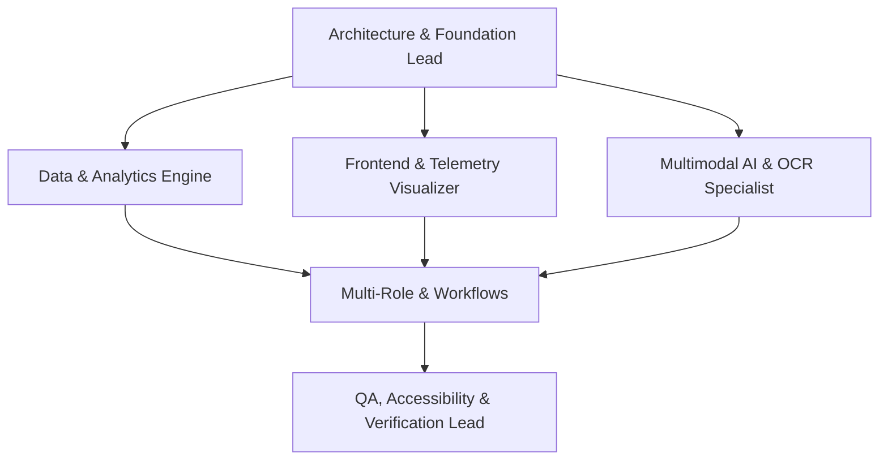

# OpenPrice Team Structure & Multi-Agent Division (`TEAM.md`)

This document outlines the specialized team roles, division of responsibilities, and collaborative workflows for executing the OpenPrice full-stack platform.

---

## 1. Team Organization & Role Division

### Role 1: Architecture & Foundation Lead
- **Scope:** Repository scaffolding, Next.js 15+ App Router setup, TypeScript configuration, Tailwind CSS design system tokens matching `DESIGN.md`, and build verification.
- **Key Artifacts:** `package.json`, `tsconfig.json`, `tailwind.config.ts`, `src/app/layout.tsx`, `src/app/globals.css`.

### Role 2: Data, Math & Analytics Engineer
- **Scope:** Mathematical price telemetry, rolling inflation index calculation, store price variance algorithms, standard deviation outlier anomaly detection ($>3\sigma$), tabular number formatters, and seed data generator.
- **Key Artifacts:** `src/lib/inflation.ts`, `src/lib/formatters.ts`, `src/lib/mock-data.ts`, `src/lib/storage.ts`, `src/types/`.

### Role 3: Multimodal AI & OCR Specialist
- **Scope:** OpenRouter multimodal vision API integration, bounding-box normalization, receipt, shelf tag, and promo flyer parsers, interactive SVG coordinate overlays, and fallback heuristics.
- **Key Artifacts:** `src/lib/openrouter.ts`, `src/lib/ocr-parser.ts`, `src/app/api/ocr/parse/route.ts`, `src/components/ocr/`.

### Role 4: Frontend UI & Telemetry Visualizer
- **Scope:** Recharts data visualizations (multi-store `PriceHistoryChart`, `Sparkline`, `InflationRadar`), atomic UI primitives (`Button`, `Input`, `Badge`, `Card`, `Modal`, `Tabs`), and responsive container shells.
- **Key Artifacts:** `src/components/ui/`, `src/components/charts/`, `src/components/product/`.

### Role 5: Multi-Role Experience Engineer
- **Scope:** Implementation of the three operational perspectives:
  - **Public Shopper:** Searchable product catalog, category filters, store price comparison matrix, and deep product detail view.
  - **Logged-in Contributor:** Ingestion studio (photo OCR, flyer batch parser, manual CRUD), watchlist price drop alerts, and contributor karma.
  - **Admin / Curator:** Community moderation queue, diff inspector, and category/store taxonomy management.
- **Key Artifacts:** `src/app/page.tsx`, `src/app/product/[id]/page.tsx`, `src/app/contribute/page.tsx`, `src/app/watchlist/page.tsx`, `src/app/admin/`.

### Role 6: QA, Accessibility & Verification Lead
- **Scope:** Comprehensive multi-layer test suite (unit math tests, component UI state tests, API route tests), WCAG 2.1 AA accessibility checks ($\ge 4.5:1$ contrast, $\ge 44\text{px}$ touch targets), performance audit, and zero-error build verification.
- **Key Artifacts:** `tests/`, `npm run type-check`, `npm run build`, `npm test`.

---

## 2. Shared Work Invariants

1. **Strict Semantic Pricing:** Emerald (`#10B981`) for savings/drops, Coral Sunset (`#F43F5E`) for hikes/inflation, Muted Slate (`#64748B`) for unchanged prices.
2. **Tabular Numerals:** All currency amounts, percentages, and timestamps must use `font-mono` / `tabular-nums`.
3. **No Placeholder Stubs:** Every handler, modal, and button must be fully functional.
4. **Attribution & Licensing:** Any external logic or open-source reference must be credited in `CREDITS.md` or `README.md`.
5. **Zero Emojis in Code:** Clean SVG icons (Lucide React) in production code; no artificial AI buzzwords.
